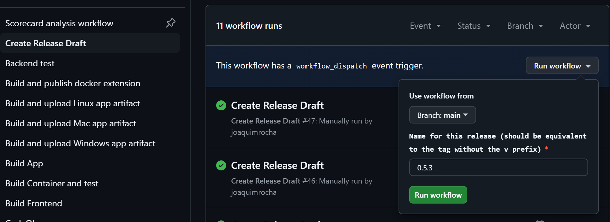

This document describes how to perform a Headlamp release.

The idea is that we list the steps here as a guide, and automate it along the way so the number of steps is reduced as much as possible in the future.

## Version bumping

We follow the [semantic versioning](https://semver.org/) guide.

## Steps to perform a Headlamp release  

When ready to perform a release (changes worth releasing since last time is done, QA is done), then:

### 1. Create a new branch

Create a new branch called "rc-X.Y.Z" where X.Y.Z is the new release version.

### 2. Bump the app “version”

On the main branch, bump the “version” field in app/package.json, run "npm i" inside app/ and commit with:

```shell
git commit app/package* -m "app: Bump version to X.Y.Z"
```

Bug fix: make a branch off the tag, and cherry pick everything in. Or off main and remove merge commits compared to previous tag (On the branch to remove merge commits do: "`git rebase main`").

```shell
git log v0.25.0.. --oneline
```


### 3. Start a release draft

Start a release draft by manually running the "Create release draft" action (it's important to give it the right release name as it creates links with that number in the draft):



### 4. Check the list of changes since the last release

Check the list of changes since the last release:

```
git log \`git describe \--abbrev=0\`..
```

Then go to the release draft created in the previous step and fill it accordingly.

Look at previous releases. Write for humans. No context part, like "frontend:". Put github user name in "(thanks @XXX )" at end of line for external contributors.


### 5. App signing

The build scripts handle app signing.

### 6. Generate Apps

Generate the apps for each the Linux, Windows, and Mac platforms by running the "Build and upload PLATFORM artifact" actions against the "rc-X.Y.Z".

### 7. Download and test Artifacts

Download the artifacts, test them and, if everything goes well, upload them to the new release's assets area.

### 8. Push Assets

Upload the binary to the release's assets with the script.

Run the push-assets.js script for pushing assets. This script pushes the assets and automatically sets the right type for them and also updates and uploads a checksums file:

```shell
   GITHUB_TOKEN=MY_TOKEN_123 node ./app/scripts/push-release-assets.js v0.19.0 Headlamp....tar.gz
```

Note: If you use the gh command line tool you can use `gh auth token`. To create a new GITHUB_TOKEN see the document [Managing your personal access tokens](https://docs.github.com/en/authentication/keeping-your-account-and-data-secure/managing-your-personal-access-tokens).


### 9. Push the new tag

Go to the main branch and merge the rc-X.Y.Z in, then tag the branch (notice the **v** before the version number):

```shell
git tag vX.Y.Z \-a \-m “Release X.Y.Z”
```


Push the new release commit and tags:

Note: DO NOT RUN THIS BELOW EXCEPT ON NEW FEATURE RELEASES.

```shell
git checkout main

git merge rc-X.Y.X \# (this should NOT create a merge commit since the bump commit is the only difference)

git push origin main

git push \--tags
```

### 10. Container images and distribution channels (flathub, homebrew)

Container images are built automatically on every tag creation and pushed to ghcr.io .

Other distribution channels like flathub, homebrew, minikube, will be done by automatically opened PRs.

### 11. Announce on social media

Ask someone in the social team (Joaquim or Chris) to toot/tweet/post about it from the social media accounts.
